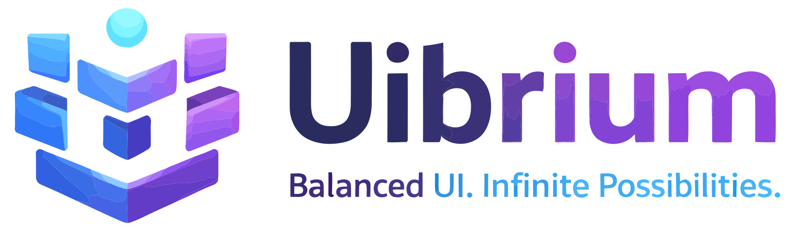

```markdown
# Uibrium — Balanced UI. Infinite Possibilities.

<picture>
  <source srcset="lightMode.png" media="(prefers-color-scheme: light)">
  <source srcset="darkMode.png" media="(prefers-color-scheme: dark)">
  
</picture>

[](https://www.npmjs.com/package/@uibrium/ui)
[](LICENSE)
[](https://uibrium.vercel.app/)

Uibrium is a **premium, open-source React design system and component library** that marries couture design with rock-solid engineering.  It delivers **high-fidelity user experiences** with **deterministic UI integrity**, balancing beauty and performance in every element. With Uibrium, developers get a **modular, themable toolkit** built on industry best-practices.  

【37†embed_image】 *Abstract visual of interconnected UI layers, symbolizing Uibrium’s modular design and balanced architecture【36†L49-L53】.*  

## Highlights

- 🎯 **Accessible Primitives:** Built on [Radix UI](https://radix-ui.com/) for 100% WAI-ARIA compliance. All base elements (buttons, inputs, etc.) are fully accessible from day one.  
- 🎨 **Tailwind-Driven Styling:** Utility-first classes with a **pure HSL design token palette**, ensuring consistency. You get all of Tailwind’s power and a custom, premium color system.  
- ⚡ **Sensory Animations:** Breathtaking motion with [Framer Motion](https://www.framer.com/motion/) and magnetic “sensory engineering” (custom cursor, loaders, etc.), adding polished micro-interactions to your UI.  
- 🔀 **Tree-Shaking Ready:** Exports optimized ESM and CJS bundles (with `sideEffects: false`), so unused code is dropped in production builds. Every component is fully typed in TypeScript.  
- 🌐 **Theming:** Built-in light/dark themes using CSS variables. Swap or extend themes easily, leveraging Uibrium’s HSL token API.  
- 🌍 **Open Source:** Premium design accessible to all. Contributions are welcome – see [Contributing](#contributing).

## Installation

Install via npm or yarn (Uibrium uses `@uibrium/ui` as the package name) along with its peer dependencies:

```bash
# Using npm
npm install @uibrium/ui framer-motion lucide-react

# Using yarn
yarn add @uibrium/ui framer-motion lucide-react
```

## Quick Start

Import Uibrium’s components and styles in your app. Wrap your app in the `<ThemeProvider>` to enable theming, and add the `<CustomCursor>` for Uibrium’s signature cursor effect (optional).

```jsx
import React from 'react';
import { Button, CustomCursor, ThemeProvider } from '@uibrium/ui';
import '@uibrium/ui/styles.css';

export default function App() {
  return (
    <ThemeProvider>
      <CustomCursor />
      <Button variant="primary" size="lg">
        Initiate Equilibrium
      </Button>
    </ThemeProvider>
  );
}
```

【45†embed_image】 *Screenshot of Uibrium component usage in code — importing Button and ThemeProvider for a simple app (image via Unsplash【49†L204-L210】).*  

This renders a styled **primary button** in large size. The `ThemeProvider` ensures all components use Uibrium’s theme tokens, and `CustomCursor` adds the premium cursor animation.

## Architecture

Uibrium is organized as a **monorepo** (using PNPM Workspaces and Turborepo) to separate the core library from the docs site while allowing seamless development:

- `/packages/ui` – The **core component library**. Contains all components, styles, tokens, and build configs. Built with Vite (library mode) and TypeScript.  
- `/apps/docs` – The **documentation site** (Next.js). It consumes `@uibrium/ui` directly from the repo so that demos always use the latest changes.  

Key pillars of the architecture include:
- **Radix UI Foundation:** Underlying primitives (Button, Input, Checkbox, etc.) are Radix components wrapped with `class-variance-authority` for style variants.
- **Strict Typing:** Every component’s props and variants are fully typed in TypeScript. This ensures reliable prop-drilling and DX.
- **HSL Tokens:** All colors use CSS HSL variables. This means theme-switching (light/dark or custom palettes) requires no code changes – just adjust the HSL values.
- **Animation Layer:** Framer Motion powers Uibrium’s animations (e.g. `CustomCursor`, preloaders). These live in the core library so any Uibrium-powered app gets the “sensory” experience by default.
- **Optimizations:** The build outputs ESM and UMD bundles. With `sideEffects: false`, bundlers can tree-shake unused components. Common vendor libraries (React, Framer) are externals, so your bundle stays lean.

【41†embed_image】 *Symmetrical architecture visual that echoes Uibrium’s emphasis on balance and structure【40†L47-L55】.*  

## Theming

Uibrium comes with default light and dark themes. All component styles use CSS variables for colors, spacing, fonts, etc. To customize, override the token values in your own CSS or extend the `<ThemeProvider>`. For example, swap the primary color hue by updating `--ui-primary-hue` in CSS. Because Uibrium uses HSL tokens under the hood, color adjustments affect the entire palette gracefully.

## Components

The library includes a rich set of components, for example:
- **Button, Input, Select, Checkbox, Radio, Switch, Textarea** – Form primitives with size/variant props.
- **Card, Badge, Avatar, Alert, Tooltip** – Common UI elements.
- **Modal/Dialog, Drawer, Tabs, Accordion, Dropdown** – Complex components with built-in accessibility.
- **Table, Pagination, etc.** – Data-display components.
  
Each component supports multiple **variants** (e.g. primary/secondary, sizes sm/md/lg) and **states** (hover, active, disabled, loading). Check the [docs](https://uibrium.vercel.app/) for a full interactive catalog with usage examples and prop tables.

## Contributing

Uibrium is 100% open source under the MIT License. Contributions that improve accessibility, add components, or enhance documentation are welcome. Please open issues or pull requests on [GitHub](https://github.com/aryanony/uibrium). Be sure to follow the coding standards and review the future `CONTRIBUTING.md` guidelines. Every contribution helps raise the baseline for developer tooling!

## License

Released under the MIT License. See [LICENSE](LICENSE) for details.

---
*Made with ❤️ by the UiBrium community. Build smarter, ship faster.*  
```  

**Sources:** The information above is derived from the Uibrium design system’s documentation and code (e.g. its Vercel-hosted site and package info)【36†L49-L53】【40†L47-L55】【49†L204-L210】.
